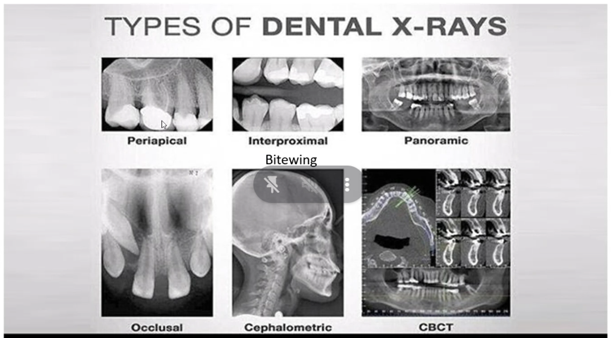
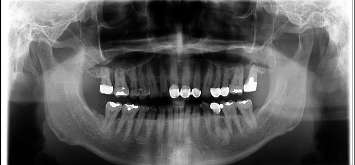
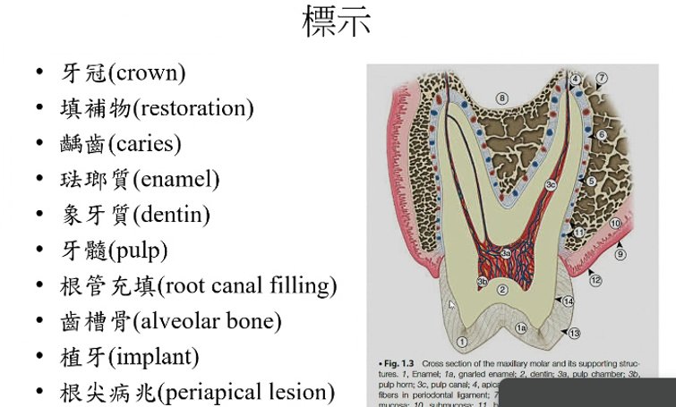
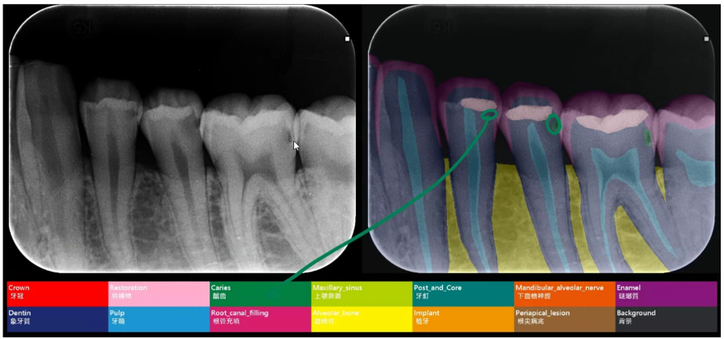
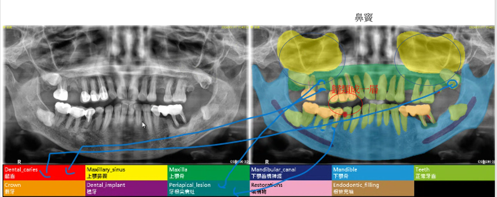
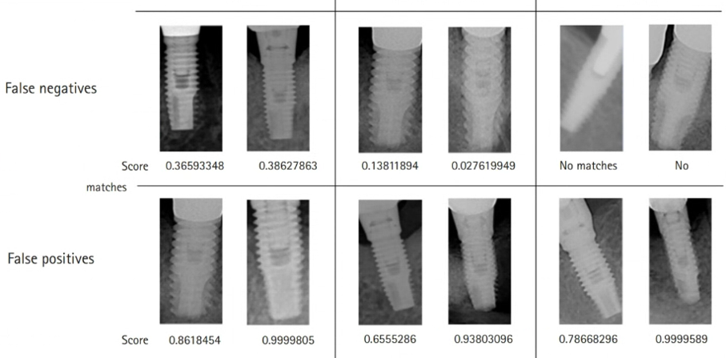

  
Periapical(PA)-我們現在使用的  
Bitewing 
牙周病拍直的 | 蛀牙拍橫的  
Panoramic(Pano)  
可能會成為未來主流 | 放大1.3倍   
Cephalometrlc-矯正用的  
CBCT-可以3D重組 | 可以以看出XYZ | 牙診所標配  

  
   
白的假牙冠跟補牙的白不一樣  

  
牙根：長短問題  
牙周韌帶：導致牙根跟牙齦有縫  
根管充填：抽牙隨塞東西進去導致X光是白的  
AI辯識-初期蛀牙  
牙冠是假的  
法郎質是真的  

  
  
過白通常都是填補的  
蛀牙不會在骨頭旁邊，會有穿進牙齒的感覺  

  
初期蛀牙 需牙醫師判斷，AI很難判斷  
位置牙縫附近、不規則形狀、從外到內  

依照牙周韌帶來分辨牙根  

  
蛀牙挑邊邊薄的地方侵入

  
  
  
  
需要再研究排序  

  

  

  

AI辯識直入牙齦的螺絲

